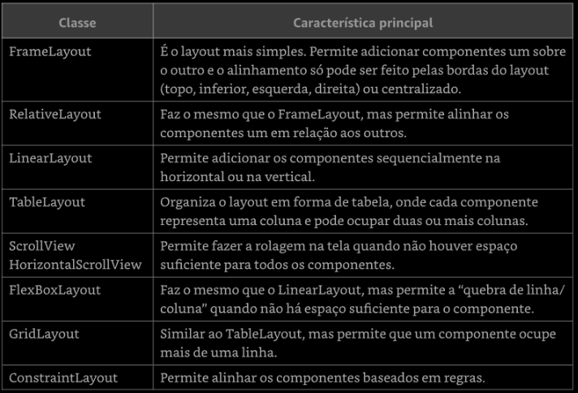
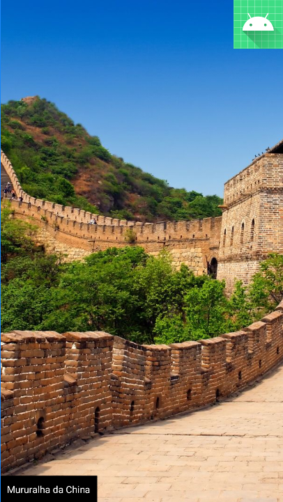
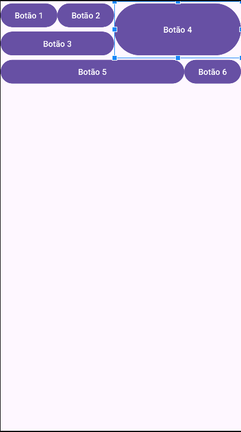
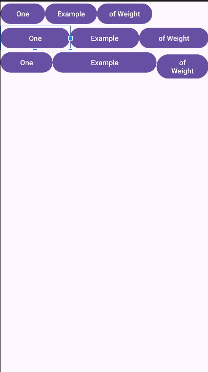
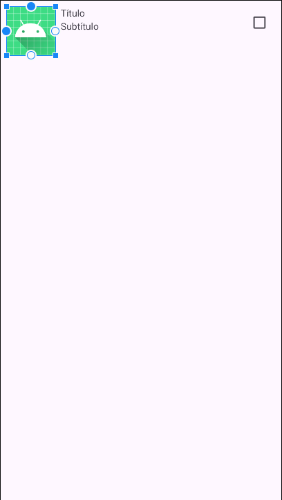
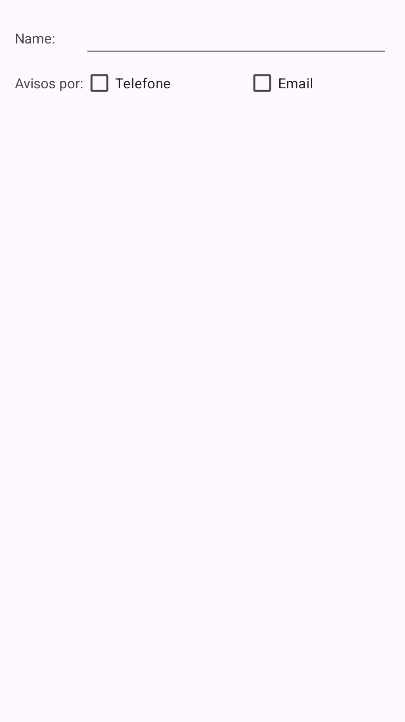
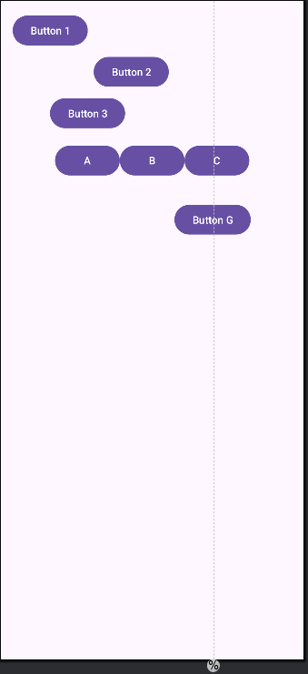
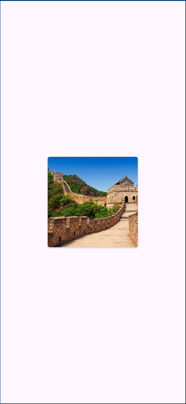
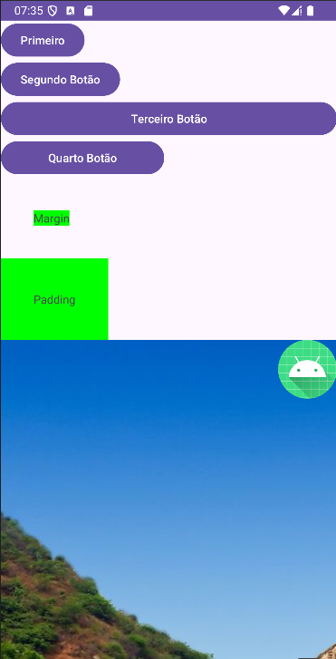
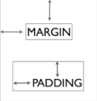

# 📱 Projeto Android: Gerenciadores de Layout e Propriedades

## 📝 **Descrição do Projeto**
Este projeto tem como objetivo demonstrar o uso dos principais **gerenciadores de layout** no Android e como configurar propriedades importantes, como *margin*, *padding*, *weight*, *height* e *width*. 

O projeto apresenta exemplos práticos de cada gerenciador de layout e explica suas principais características e propriedades.

---

## 🚀 **Gerenciadores de Layout**

### 🖼️ **FrameLayout**
- O **FrameLayout** é um gerenciador simples que organiza as views empilhando-as umas sobre as outras.
- Útil para exibir uma única view ou sobrepor elementos.
- **Propriedades principais**:
  - `layout_gravity`: Define a posição da view dentro do FrameLayout (ex.: `top`, `bottom`, `center`).
  - `layout_margin`: Define o espaço externo ao redor da view.

#### Exemplo Visual:

---

### 🟦 **GridLayout**
- O **GridLayout** organiza as views em uma grade (linhas e colunas).
- Ideal para layouts com estrutura tabular.
- **Propriedades principais**:
  - `rowCount` e `columnCount`: Definem o número de linhas e colunas.
  - `layout_row` e `layout_column`: Especificam a posição da view na grade.
  - `layout_gravity`: Alinha a view dentro da célula.
  - `layout_columnSpan`: Permite que uma view ocupe várias colunas.

#### Exemplo Visual:

---

### ➖ **LinearLayout**
- O **LinearLayout** organiza as views em uma única direção: horizontal ou vertical.
- Útil para criar layouts simples e alinhados.
- **Propriedades principais**:
  - `orientation`: Define a direção das views (`horizontal` ou `vertical`).
  - `weightSum` e `layout_weight`: Controlam a distribuição proporcional do espaço entre as views.
  - `gravity`: Alinha todas as views dentro do LinearLayout.

#### Exemplo Visual:

---

### 🔗 **RelativeLayout**
- O **RelativeLayout** posiciona as views em relação a outras views ou ao próprio contêiner.
- Flexível para criar layouts complexos sem aninhamento excessivo.
- **Propriedades principais**:
  - `layout_alignParentTop`, `layout_alignParentBottom`, etc.: Posicionam a view em relação ao contêiner pai.
  - `layout_toRightOf`, `layout_below`, etc.: Posicionam a view em relação a outras views.

#### Exemplo Visual:

---

### 🔲 **TableLayout**
- O **TableLayout** organiza as views em linhas e colunas, semelhante a uma tabela HTML.
- Cada linha é representada por um elemento `<TableRow>`.
- **Propriedades principais**:
  - `stretchColumns`: Faz com que colunas específicas se ajustem automaticamente ao espaço disponível.
  - `shrinkColumns`: Permite que colunas específicas sejam reduzidas quando necessário.

#### Exemplo Visual:

---

### 🧩 **ConstraintLayout**
- O **ConstraintLayout** é um gerenciador poderoso que permite posicionar views usando restrições relativas umas às outras ou ao contêiner pai.
- Ideal para criar layouts responsivos sem aninhamento excessivo.
- **Propriedades principais**:
  - `layout_constraintTop_toTopOf`, `layout_constraintStart_toStartOf`, etc.: Criam restrições entre views ou com o contêiner pai.
  - `bias`: Controla o peso relativo entre restrições (ex.: centralizar parcialmente).
  - Suporte para *Guidelines* e *Chains* para alinhamento avançado.

#### Exemplo Visual:

---

### 🃏 **CardView**
- O **CardView** é um contêiner estilizado que permite exibir conteúdo com bordas arredondadas, sombras e elevação. É amplamente usado para destacar informações em listas ou seções visuais.
- Ideal para criar cartões visuais modernos no aplicativo.
- **Propriedades principais**:
  - `cardCornerRadius`: Define o raio das bordas arredondadas.
  - `cardElevation`: Define a elevação (sombra) do cartão.
  - `contentPadding`: Define o espaço interno dentro do CardView.

#### Exemplo Visual:

---

### 🖱️ **ScrollView**
- O **ScrollView** é um contêiner que permite rolar o conteúdo quando ele excede o tamanho da tela. Ele suporta apenas um filho direto, mas esse filho pode conter várias views agrupadas (como um LinearLayout).
- Ideal para layouts com muito conteúdo vertical que não cabe na tela de uma vez.
- Existe também o equivalente horizontal: **HorizontalScrollView**.
- **Propriedades principais**:
  - Funciona automaticamente quando o conteúdo excede os limites da tela.

#### Exemplo Visual:

---

## 🛠️ **Propriedades Importantes**

### 📏 Margin
- Define o espaço externo ao redor de uma view (fora das bordas).
- Propriedade:
  `android:layout_margin="16dp"`
- Pode ser configurada individualmente para cada lado:
  `android:layout_marginStart="8dp"`
  `android:layout_marginEnd="8dp"`
  `android:layout_marginTop="16dp"`
  `android:layout_marginBottom="16dp"`
  
---

### 📐 Padding
- Define o espaço interno dentro de uma view (entre o conteúdo e as bordas).
- Propriedade:
  `android:padding="16dp"`
- Pode ser configurada individualmente para cada lado:
  `android:paddingStart="8dp"`
  `android:paddingEnd="8dp"`
  `android:paddingTop="16dp"`
  `android:paddingBottom="16dp"`

  

---

### ⚖️ Weight
- Usado no **LinearLayout** para distribuir o espaço proporcionalmente entre as views.
- Propriedade:
  `android:layout_weight="1"`
- Funciona em conjunto com a largura ou altura configuradas como `0dp` (peso define o tamanho).

---

### 📏 Width & Height
- Controlam a largura (*width*) e altura (*height*) de uma view.
- Valores comuns:
- `match_parent`: A view ocupa todo o espaço disponível no contêiner pai.
- `wrap_content`: A view se ajusta ao tamanho do seu conteúdo.
- Valores fixos, como `"100dp"`.

Exemplo:
  `android:layout_width="match_parent"`
  `android:layout_height="wrap_content"`

---
